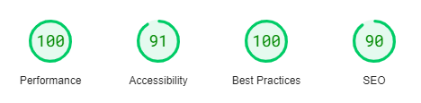

# myDay

A one stop shop for school's default homepages allowing administrators to link useful sites, and important information in a modular, easy to use framework.

Looking for the main code repository? Find that at [leowilkin/myday](https://github.com/leowilkin)!

View the documentation [here](https://myday.wilkin.xyz).

View this demo [here](https://demo.myday.wilkin.xyz).

Documentation can be found here:
- docs/adding-cards.md
- docs/creating-a-new-tab.md
- docs/svg-docs.md
